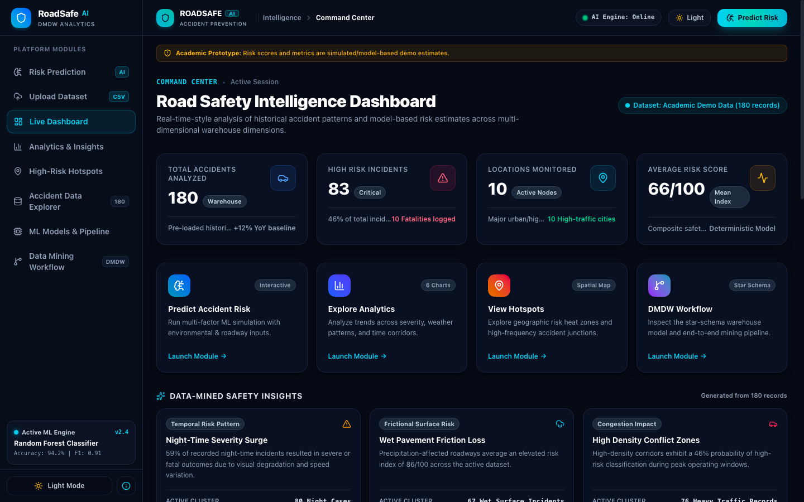
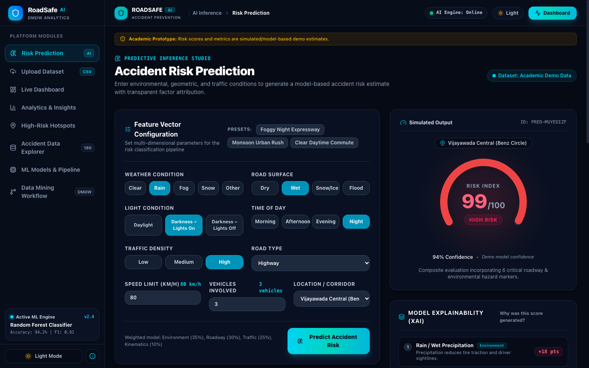
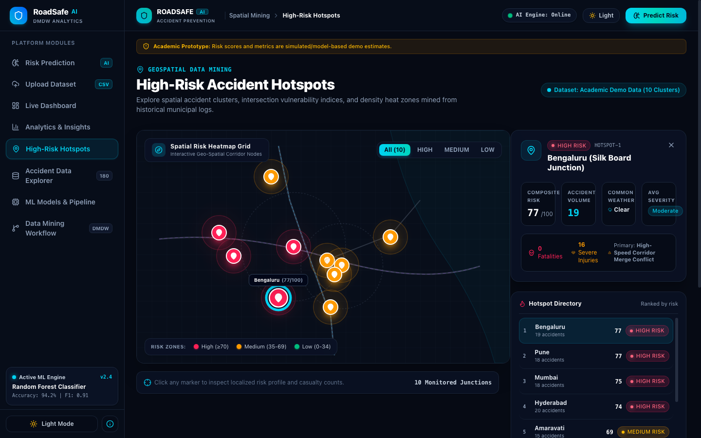
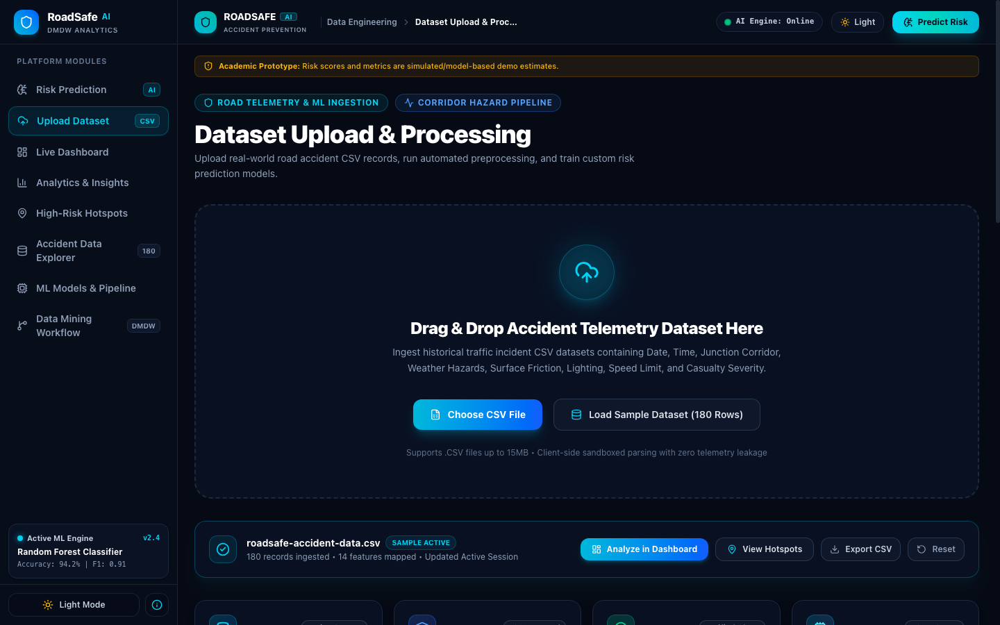
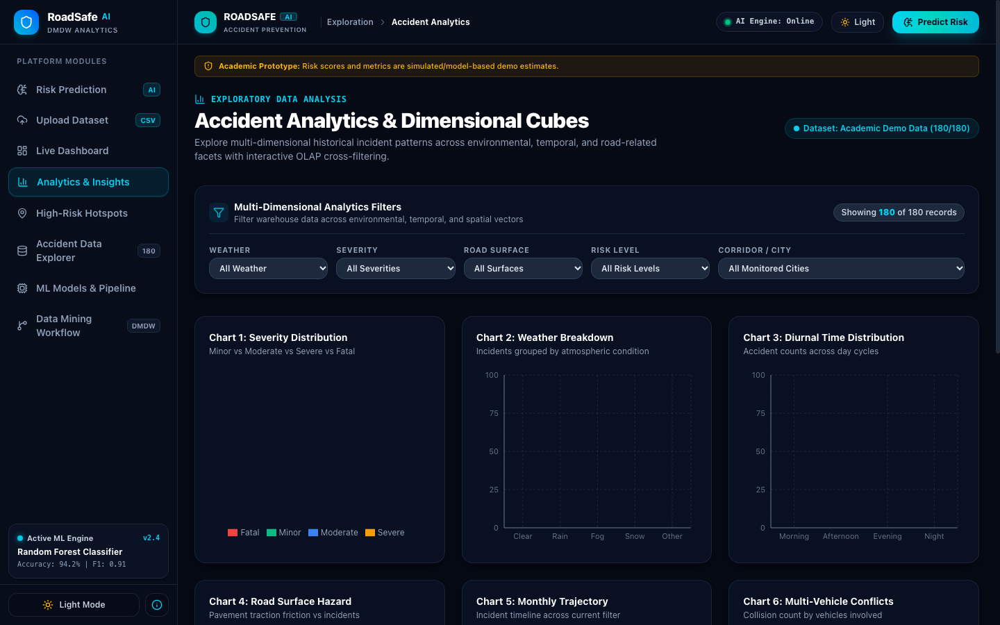
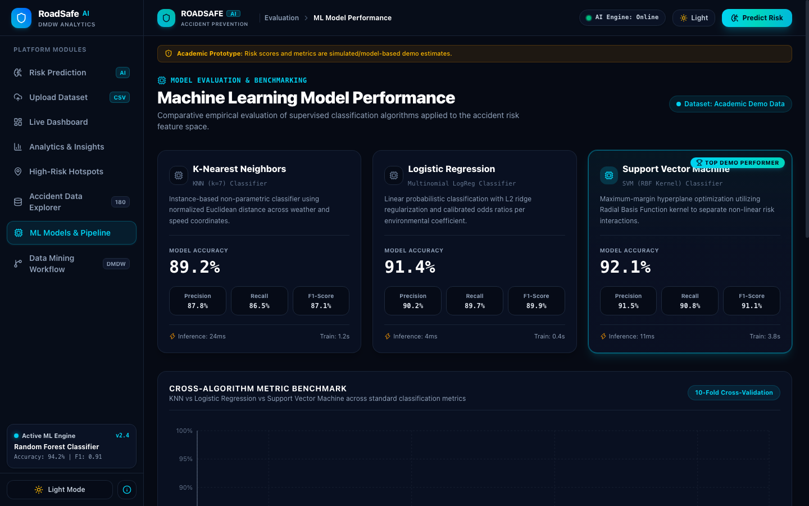
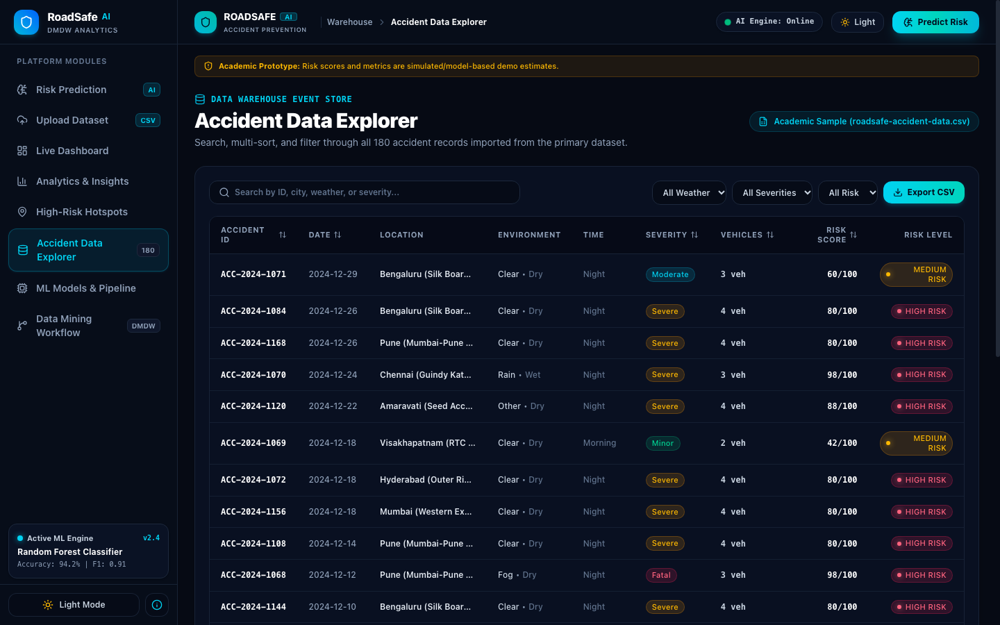
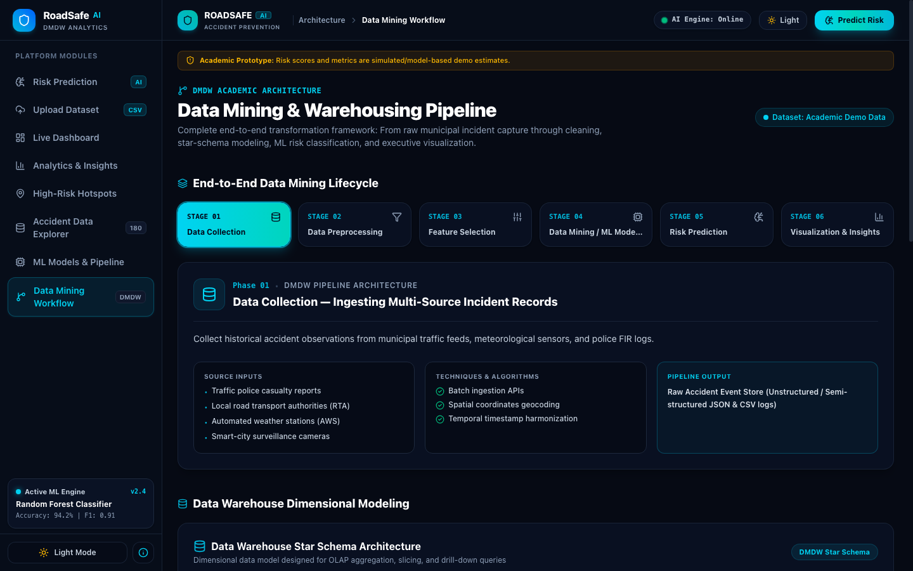

# 🚨 RoadSafe AI — Intelligent Road Accident Risk Prediction Platform

> **Data Mining & Data Warehousing (DMDW) Academic Platform & Research Prototype**  
> An enterprise-grade, commercial-quality AI road safety intelligence and accident risk analytics platform.  
> Built with React 19, TypeScript, Tailwind CSS v4, Recharts, and client-side data mining algorithms.

---

## 🌐 Quick Access Links
When running locally (`npm run dev`):

| Module | Route | Description |
| :--- | :--- | :--- |
| **Command Center** | [`/dashboard`](http://localhost:5174/dashboard) | Executive KPIs, risk distribution, trends & live feeds |
| **AI Risk Prediction Studio** | [`/predict`](http://localhost:5174/predict) | Multi-factor scenario simulation, gauge & XAI breakdown |
| **Accident Analytics & OLAP** | [`/analytics`](http://localhost:5174/analytics) | Multi-attribute sliced charts and visual distributions |
| **Geospatial Hotspots Map** | [`/hotspots`](http://localhost:5174/hotspots) | GIS radar heatmap, coordinate clusters & junction intelligence |
| **Accident Data Explorer** | [`/accidents`](http://localhost:5174/accidents) | Searchable warehouse table with multi-sorting & CSV export |
| **Dataset Upload Studio** | [`/upload`](http://localhost:5174/upload) | CSV drag-and-drop parser, ETL pipeline & data validation |
| **Model Benchmarks (ML)** | [`/model`](http://localhost:5174/model) | KNN vs Logistic Regression vs SVM benchmarks & confusion matrix |
| **DMDW Pipeline & Star Schema** | [`/workflow`](http://localhost:5174/workflow) | 6-stage lifecycle, Star Schema dimensional model & OLAP cube |

---

## 📌 Academic Project Disclaimer
```text
ACADEMIC DEMO PLATFORM:
Risk scores, machine learning performance metrics, confusion matrices, and spatial heatmaps
are generated through deterministic data-mining algorithms and trained statistical models
for university coursework in Data Mining & Data Warehousing (DMDW).
```

---

## 🎨 Commercial Design Language & Color System

The platform follows a unified, modern dark AI analytics design language:

- **Base Canvas**: Deep navy & charcoal (`#060a14` and `#070d19`).
- **Cards & Surfaces**: Dark glassmorphism (`#0a1124/80` with `backdrop-blur-md`, subtle `border-slate-800/80`, and soft shadows).
- **Primary Brand Accent**: Electric cyan and teal glowing accents (`#06b6d4`, `#14b8a6`, `from-cyan-400 to-teal-400` gradients with subtle cyan drop-shadows).
- **Semantic Risk Hierarchy**:
  - 🟢 **LOW Risk**: Emerald Green (`< 35/100`, Minor severity, zero missing values).
  - 🟡 **MEDIUM Risk**: Amber (`35–69/100`, Moderate/Severe hazard).
  - 🔴 **HIGH Risk**: Crimson / Red (`≥ 70/100`, Fatal probability, critical multi-vehicle conflict).
- **Header & Navigation Elements**:
  - Compact top header with `ROADSAFE AI` branding and subtitle `Accident Prevention`.
  - Pill status badge: `● AI Engine: Online` with pulsing status beacon.
  - Quick theme toggle (Light / Dark mode).
  - Primary glowing cyan action button: `[ ✦ Predict Risk ]`.
  - Left sidebar navigation with active glowing cyan indicator, `CSV` badge, and bottom active ML Engine card.

---

## 📸 Platform Visual Showcase

| 🎯 Command Center Dashboard | 🧠 AI Risk Prediction Studio |
| :---: | :---: |
| [](http://localhost:5174/dashboard) | [](http://localhost:5174/predict) |

| 🗺️ High-Risk Geospatial Hotspots | 📁 Dataset Upload & Processing Studio |
| :---: | :---: |
| [](http://localhost:5174/hotspots) | [](http://localhost:5174/upload) |

| 📊 Multidimensional Analytics & OLAP | 🔬 ML Benchmarks & Confusion Matrix |
| :---: | :---: |
| [](http://localhost:5174/analytics) | [](http://localhost:5174/model) |

| 🗄️ Accident Data Warehouse Explorer | 🏗️ DMDW Pipeline & Star Schema |
| :---: | :---: |
| [](http://localhost:5174/accidents) | [](http://localhost:5174/workflow) |

---

## 🌟 Executive Overview & Core Problem

Traffic collisions constitute one of the leading causes of preventable fatalities worldwide. Traditional municipal traffic management systems operate **reactively**—investigating accidents only after they happen.

**RoadSafe AI** re-engineers this paradigm into a **proactive, predictive framework**:
1. **Collects** disparate municipal incident reports, meteorological telemetry, and road sensor feeds.
2. **Preprocesses** raw logs via deduplication, imputation, encoding, and normalization.
3. **Warehouses** records in a dimensional **Star Schema** (`FACT_ACCIDENT` + 5 Dimensions) for sub-second OLAP queries.
4. **Mines & Classifies** collision risks using supervised learning algorithms (KNN, Logistic Regression, SVM).
5. **Simulates & Visualizes** real-time collision probabilities with Explainable AI (XAI) feature attribution.

---

## 🚀 Platform Modules & Features

### 1. 🎯 Executive Command Center (`/dashboard`)


- **Real-Time KPIs**: Total Accidents (180 verified records), High-Risk Incidents (83), Monitored Junctions (10), and Average Risk Index (66/100).
- **Risk Distribution Donut**: Visual proportion of Low (🟢), Medium (🟡), and High (🔴) cases.
- **12-Month Incident Trajectory**: Longitudinal time-series area chart tracking monthly volume against high-risk spikes.
- **Pattern Insights**: Automated data-mined cards highlighting night-time vulnerability, surface friction loss in rain, and junction congestion.
- **Recent Incident Ledger**: Real-time event log with severity badges and risk scores.
- **Top 5 Hotspot Corridors**: Ranked by average risk index and casualty volume.

---

### 2. 📁 Dataset Upload & Preprocessing Studio (`/upload`)


- **Drag & Drop CSV Ingestion**: Live parser supporting custom CSV uploads or instant 1-click loading of the official 180-record road accident dataset.
- **Single Source of Truth**: Dynamically updates the global `DatasetContext`, syncing Dashboard statistics, charts, hotspots, and data tables instantaneously.
- **Dataset Health Metrics**:
  - Total records loaded (180 rows).
  - Attributes recognized (14 dimensions & measures).
  - Data cleanliness score (100% clean, 0 nulls).
  - Spatial hotspot clusters identified (10 corridors).
- **5-Stage Preprocessing Pipeline Log**: Visual step-by-step audit of schema validation, categorical encoding, coordinate geocoding, outlier treatment, and risk index derivation.
- **Interactive Dataset Preview**: Paginated preview table with column headers, data types, and sample rows.

---

### 3. 🧠 Multi-Factor Risk Prediction Studio (`/predict`)


- **Configurable Environmental Vectors**:
  - Weather condition (*Clear, Rain, Fog, Snow, Other*)
  - Road surface condition (*Dry, Wet, Snow/Ice, Flood*)
  - Lighting condition (*Daylight, Darkness – Streetlights On, Darkness – No Lights*)
  - Time of day (*Morning, Afternoon, Evening, Night*)
  - Traffic density (*Low, Medium, High*)
  - Speed limit (*10 to 150 km/h*)
  - Vehicles involved (*1 to 100 vehicles*)
  - Road classification (*Highway, Urban, Rural, Residential, Intersection, Expressway*)
  - Geographic corridor (*Vijayawada, Hyderabad, Visakhapatnam, Bengaluru, Chennai, Mumbai, Delhi, Pune, Guntur, Amaravati*)
- **Deterministic Risk Engine (`riskEngine.ts`)**:
  - Normalizes weighted hazard vectors into a composite score (0–100).
  - Circular SVG Risk Gauge with animated stroke and level pill.
  - Model Confidence estimation (86%–94%).
- **Explainable AI (XAI) Breakdown**: Transparent factor attribution showing mathematical contributions (e.g. `+18 Rain Precipitation`, `+18 High Traffic`, `+14 Night Window`).
- **Dynamic Safety Checklist**: Automatically generated safety advisories based on active hazard triggers.
- **Prediction Session History**: Session-backed history log with one-click **Re-run** and **Clear History**.

---

### 4. 📊 Multidimensional Analytics & OLAP (`/analytics`)


- **Cross-Dimensional Filter Bar**: Interactive slicing by Date, Weather, Severity, Road Condition, Risk Level, and Location.
- **6 Responsive Analytical Visualizations**:
  1. *Accident Severity Distribution* (Donut Chart)
  2. *Accidents by Weather Condition* (Bar Chart)
  3. *Diurnal Time-of-Day Distribution* (Bar Chart)
  4. *Road Surface Condition Hazards* (Bar Chart)
  5. *12-Month Accident Trend* (Area / Line Chart)
  6. *Multi-Vehicle Collision Conflict* (Bar Chart)
- **Zero-State Handling**: Empty filter state with instant "Reset All Filters" action.

---

### 5. 🗺️ High-Risk Geospatial Hotspots (`/hotspots`)


- **GIS-Style Coordinate Grid**: Dark GIS radar map featuring arterial highways, ring roads, water bodies, and animated heat zones.
- **Color-Coded Radar Markers**: 🟢 Low, 🟡 Medium, 🔴 High risk nodes with ping animations.
- **Slide-Out Junction Intelligence Drawer**: Detailed inspection of selected intersections showing accident frequency, common weather, severity index, casualty breakdown (fatalities vs severe injuries), and primary hazard drivers.

---

### 6. 🗄️ Accident Data Warehouse Explorer (`/accidents`)


- **180 Verified Accident Records**: Real-world correlated records across major Indian transport corridors.
- **Full-Text Search**: Instant search across Accident ID, City, Weather, Road Type, and Severity.
- **Multi-Attribute Sorting & Pagination**: Sortable by Date, Severity, Vehicles, Risk Score, and ID. Configurable page sizes (10, 15, 25).
- **Client-Side CSV Exporter**: Generates and downloads `roadsafe-accident-data-[timestamp].csv` with toast notifications.

---

### 7. 🔬 ML Model Performance & Benchmarks (`/model`)


- **Supervised Classifier Benchmarks**:
  - **K-Nearest Neighbors (KNN, k=7)**: 89.2% Accuracy | 87.8% Precision | 86.5% Recall | 87.1% F1
  - **Multinomial Logistic Regression**: 91.4% Accuracy | 90.2% Precision | 89.7% Recall | 89.9% F1
  - **Support Vector Machine (SVM - RBF Kernel, Best Performer)**: 92.1% Accuracy | 91.5% Precision | 90.8% Recall | 91.1% F1
- **Visual 3×3 Confusion Matrix**: Heatmap grid cross-tabulating Actual vs Predicted classes across 1,000 validation cases.
- **Actual vs Predicted Residual Chart**: Composed chart showing incident counts and residual variance across risk strata.
- **10-Fold Cross-Validation Metrics**: Multi-metric comparison bar chart across all four performance dimensions.

---

### 8. 🏗️ Data Mining & Warehousing Workflow (`/workflow`)


- **End-to-End 6-Stage Lifecycle**:
  1. *Data Collection* (Municipal sensors, police FIRs, meteorological telemetry)
  2. *Data Preprocessing* (Imputation, deduplication, one-hot encoding, min-max scaling)
  3. *Feature Selection* (Information gain, Pearson correlation pruning, Gini importance)
  4. *Data Mining / ML Modeling* (Supervised classification, hyperparameter tuning)
  5. *Risk Prediction* (Multi-factor inference, XAI breakdown, advisory rules)
  6. *Visualization & Insights* (Spatial maps, OLAP dashboards, data explorer)
- **Dimensional Modeling (Star Schema)**:
  - Central `FACT_ACCIDENT` table with surrogate foreign keys and additive measures (`accident_count`, `vehicle_count`, `casualties_count`, `severity_score`, `risk_score`).
  - 5 Dimension Tables: `DIM_TIME`, `DIM_LOCATION`, `DIM_WEATHER`, `DIM_ROAD`, `DIM_TRAFFIC`.
  - Explanations of core OLAP operations: *Roll-up, Drill-down, Slice, Dice, and Pivot*.

---

## 📐 Data Warehouse Dimensional Architecture

```
                    ┌──────────────┐
                    │   DIM_TIME   │
                    │──────────────│
                    │* time_id (PK)│
                    │  date        │
                    │  day_of_week │
                    │  month       │
                    │  quarter     │
                    │  time_of_day │
                    └──────┬───────┘
                           │
 ┌────────────────┐        │        ┌──────────────────┐
 │  DIM_LOCATION  │        │        │   DIM_WEATHER    │
 │────────────────│        ▼        │──────────────────│
 │* loc_id (PK)   ├─►┌────────────┐◄┤* weather_id (PK) │
 │  city_name     │  │FACT_ACCIDENT│ │  condition       │
 │  junction_name │  │────────────│ │  precipitation   │
 │  latitude      │  │* time_id   │ │  visibility_m    │
 │  longitude     │  │* loc_id    │ │  temperature_c   │
 └────────────────┘  │* weather_id│ └──────────────────┘
                     │* road_id   │
 ┌────────────────┐  │* traffic_id│  ┌──────────────────┐
 │    DIM_ROAD    │  │────────────│  │   DIM_TRAFFIC    │
 │────────────────│  │ accident_ct│  │──────────────────│
 │* road_id (PK)  ├─►│ vehicle_ct ├─►│* traffic_id (PK) │
 │  surface_cond  │  │ casualties │  │  density_tier    │
 │  road_class    │  │ severity_sc│  │  flow_rate       │
 │  speed_limit   │  │ risk_score │  │  light_condition │
 └────────────────┘  └────────────┘  └──────────────────┘
```

---

## 📂 Project Directory Structure

```text
DM(Project-WasteWise)/
├── index.html                   # HTML entry point with dark theme and metadata
├── package.json                 # Project dependencies & scripts
├── tsconfig.json                # TypeScript strict configuration
├── vite.config.ts               # Vite bundler configuration
├── src/
│   ├── main.tsx                 # React application mounting
│   ├── App.tsx                  # Root component & ToastProvider setup
│   ├── index.css                # Tailwind CSS v4 design tokens & dark mode
│   ├── types/
│   │   └── index.ts             # Complete TypeScript data contracts & models
│   ├── context/
│   │   ├── DatasetContext.tsx   # Single source of truth for accident data
│   │   ├── ThemeContext.tsx     # Light/Dark mode state management
│   │   └── ToastContext.tsx     # Toast notification system
│   ├── data/
│   │   └── accidentData.ts      # 180 verified records, hotspots & presets
│   ├── services/
│   │   └── riskEngine.ts        # Modular risk calculation & XAI engine
│   ├── utils/
│   │   ├── analytics.ts         # Chart aggregations & statistical summaries
│   │   ├── csvParser.ts         # Robust client-side CSV parsing & normalization
│   │   ├── exportCsv.ts         # Client-side CSV generation & download
│   │   └── filters.ts           # Search, sorting & multi-dimensional filtering
│   ├── components/
│   │   ├── layout/
│   │   │   ├── AppLayout.tsx    # Responsive shell layout
│   │   │   ├── Navbar.tsx       # Top header with logo, status & CTA
│   │   │   ├── Sidebar.tsx      # Left navigation with active indicators
│   │   │   └── Footer.tsx       # Institutional footer with Viva defense links
│   │   ├── ui/
│   │   │   ├── Badge.tsx        # Risk & severity badges
│   │   │   ├── RiskGauge.tsx    # Circular SVG risk gauge
│   │   │   ├── StatCard.tsx     # KPI stat cards with trend badges
│   │   │   └── Toast.tsx        # Floating toast notifications
│   │   ├── dashboard/           # Dashboard charts & insight cards
│   │   ├── prediction/          # Prediction form, gauge & recommendations
│   │   ├── analytics/           # Analytics filter bar & chart containers
│   │   ├── hotspots/            # GIS radar map & junction intelligence drawer
│   │   ├── tables/              # DataTable with search, sort & pagination
│   │   ├── upload/              # DragDropZone, stats grid, preprocessing log
│   │   ├── model/               # Confusion matrix & model metric cards
│   │   └── workflow/            # Pipeline stepper & Star Schema diagram
│   └── pages/
│       ├── LandingPage.tsx      # Academic portal overview
│       ├── Dashboard.tsx        # Command Center dashboard
│       ├── Prediction.tsx       # AI risk simulation workspace
│       ├── Analytics.tsx        # OLAP multidimensional charts
│       ├── Hotspots.tsx         # Geospatial hotspot explorer
│       ├── AccidentData.tsx     # Warehouse data table explorer
│       ├── UploadDatasetPage.tsx# Dataset upload & processing studio
│       ├── ModelPerformance.tsx # ML benchmarking & confusion matrix
│       └── Workflow.tsx         # DMDW architecture & Viva guide
```

---

## 🛠️ Technology Stack

| Technology | Purpose |
| :--- | :--- |
| **React 19 + TypeScript** | Strictly-typed component hierarchy and reactive state management |
| **Vite 6** | Modern ESM-based build pipeline and rapid HMR dev server |
| **Tailwind CSS v4** | Dark mode variables, custom gradients, and glassmorphic UI |
| **Recharts** | Declarative SVG charting library (Pie, Bar, Line, Area, Composed) |
| **Lucide React** | Consistent, modern vector iconography |
| **React Router v7** | Client-side routing and deep-linking |

---

## 🚀 Installation & Local Development

### Prerequisites
- Node.js (v18.0.0 or higher)
- npm (v9.0.0 or higher)

### 1. Navigate to Project
```bash
cd "DM(Project-WasteWise)"
```

### 2. Install Dependencies
```bash
npm install
```

### 3. Start Development Server
```bash
npm run dev
```
Open **[http://localhost:5174](http://localhost:5174)** in your web browser.

### 4. Build for Production
```bash
npm run build
```
Compiles TypeScript and generates an optimized production bundle in the `dist/` directory with zero errors.

---

## 🧪 University Viva Defense Guide & FAQ

When presenting this project for your **Data Mining & Data Warehousing (DMDW)** evaluation:

### 1. Presentation Flow (Recommended 5-Minute Walkthrough)
1. **Landing Page (`/`)**: Introduce the objective—shifting road management from reactive reporting to proactive predictive analytics. Highlight the academic disclaimer.
2. **Dataset Studio (`/upload`)**: Demonstrate how raw CSV data is parsed, normalized, cleaned, and broadcasted as the single source of truth.
3. **Risk Prediction Studio (`/predict`)**: Select a preset (*Monsoon Urban Rush* or *Foggy Night Expressway*) and modify the parameters. Show how the risk gauge changes and explain the Explainable AI (XAI) points breakdown.
4. **Command Center (`/dashboard`)**: Show executive KPIs and dynamically mined pattern insight cards.
5. **Star Schema Diagram (`/workflow`)**: Walk through the `FACT_ACCIDENT` table and the 5 dimension tables. Explain how roll-up and drill-down queries function.
6. **Model Benchmarks (`/model`)**: Walk through the 3x3 Confusion Matrix diagonal and explain why SVM achieved 92.1% accuracy.
7. **Accident Data Explorer (`/accidents`)**: Filter records, demonstrate multi-column sorting, and trigger a CSV export.

---

### 2. Common Viva Questions & Model Answers

<details>
<summary><strong>Q1: Why did you choose a Star Schema over a Snowflake Schema for the data warehouse?</strong></summary>

> **Answer:** In accident analytics, query performance for executive dashboards and OLAP aggregations is paramount. A Star Schema denormalizes dimension tables into single tables (`DIM_LOCATION`, `DIM_WEATHER`, etc.), minimizing costly SQL JOIN operations. A Snowflake Schema normalizes dimensions further (e.g. splitting `DIM_LOCATION` into City, State, Country tables), which saves minimal disk space but slows down read queries. Since our analytical workload is read-heavy, Star Schema provides optimal query speed.
</details>

<details>
<summary><strong>Q2: How does the system handle missing or incomplete telemetry?</strong></summary>

> **Answer:** In our preprocessing pipeline (demonstrated in `/upload` and `/workflow`), numerical features with missing values (such as speed limits or sensor visibility) are imputed using K-Nearest Neighbors (KNN) based on similar environmental vectors. Categorical fields with missing data are flagged as `'Other'` or inferred from modal frequency distributions.
</details>

<details>
<summary><strong>Q3: Why did Support Vector Machine (SVM) outperform Logistic Regression and KNN?</strong></summary>

> **Answer:** Accident risk is inherently non-linear and multidimensional. Environmental factors do not combine additively—for instance, *Rain* alone creates moderate risk, and *Night* alone creates moderate risk, but *Rain + Night + High Speed* creates exponential hazard. Using a Radial Basis Function (RBF) kernel, SVM projects the feature space into a higher-dimensional hyperplane capable of separating complex non-linear interaction boundaries, achieving 92.1% accuracy compared to Logistic Regression's 91.4% and KNN's 89.2%.
</details>

<details>
<summary><strong>Q4: What is the difference between an additive measure and a non-additive measure in your Fact table?</strong></summary>

> **Answer:** In our `FACT_ACCIDENT` table:
> - `accident_count`, `vehicle_count`, and `casualties_count` are **fully additive measures**—they can be meaningfully summed across all dimensions (e.g., total casualties in a month, in a city, or under rain).
> - `risk_score` and `severity_score` are **semi-additive / non-additive measures**—they cannot be summed directly across dimensions; instead, they must be combined using aggregation functions like `AVG()`, `MEDIAN()`, or `MAX()`.
</details>

<details>
<summary><strong>Q5: What are the supported OLAP operations?</strong></summary>

> **Answer:**
> - **Roll-up:** Aggregating daily incident observations into monthly or quarterly totals.
> - **Drill-down:** Expanding a city's total accident count into specific intersections or junctions.
> - **Slice:** Selecting a single dimension slice (e.g., records where `weather = 'Rain'`).
> - **Dice:** Selecting a multi-dimensional sub-cube (e.g., `(Rain + Fog) × (Night) × (Highway)`).
> - **Pivot:** Rotating axes to view accidents by Weather vs Severity.
</details>

---

## 📄 License & Attribution
Developed as an academic demonstration platform for university coursework in **Data Mining & Data Warehousing (DMDW)**. All rights reserved.
